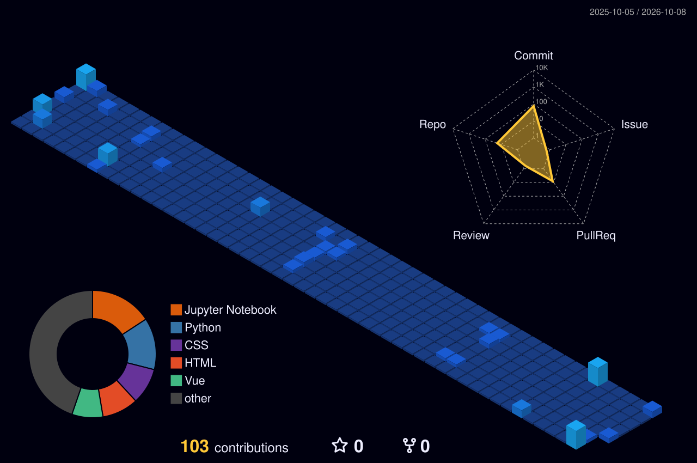

<!-- ========== HEADER ========== -->

 

---

##  About Me

I'm **Pratik Ranjan Bishwal**, an **aspiring Data Scientist and Web Developer** with a strong interest in **Data Science, Machine Learning, and Software Development**.

I am currently pursuing a **BS in Data Science and Applications from IIT Madras**, alongside an **Integrated M.Sc. in Computer Science from the Central University of Rajasthan (CURAJ)**. This combination is helping me build a strong foundation in computer science, analytical thinking, and data-driven problem solving.

I enjoy turning ideas into **practical projects and real-world solutions**. I love learning and exploring new technologies and look forward to working more deeply with them to continuously expand my technical expertise.

I take pride in the **dedication and commitment** I bring to my work. For me, putting consistent effort into something and seeing that effort translate into meaningful results is genuinely satisfying. I believe that continuous learning, disciplined work, and hands-on experience are essential for both professional and personal growth.

**Currently focused on:** Machine Learning, Data Science, Web Development, Data Structures & Algorithms, and building reliable software solutions.

**Open to:** Collaborating on open-source projects, web applications, Data/ML projects, and connecting with people passionate about technology and innovation.

**Beyond technology:** I enjoy travelling, exploring new places, meeting new people, and building meaningful connections.

> **Always learning. Always building. 🚀**

---

## Education

| Institution | Program |
| :--- | :--- |
| **Indian Institute of Technology Madras** | BS in Data Science and Applications |
| **Central University of Rajasthan** | Integrated M.Sc. in Computer Science |

---

## Tech Stack

 

| Category | Technologies |
| :--- | :--- |
| **Languages** | Python · Java · JavaScript |
| **Web Development** | Flask · Vue.js · HTML · CSS |
| **Databases** | MySQL · SQLite |
| **Data / ML** | NumPy · Pandas · Scikit-learn · Matplotlib |
| **Core CS** | Data Structures & Algorithms · Database Management Systems |
| **Tools** | Git · GitHub · VS Code · Linux/System Commands |

---

## GitHub Stats

  

---

## 3D Contribution Graph

---

## Contribution Snake

<picture>
  <source
    media="(prefers-color-scheme: dark)"
    srcset="https://raw.githubusercontent.com/pratikranjan6/pratikranjan6/output/github-snake-dark.svg"
  />

  <source
    media="(prefers-color-scheme: light)"
    srcset="https://raw.githubusercontent.com/pratikranjan6/pratikranjan6/output/github-snake.svg"
  />

  
</picture>

---

## Featured Projects

### MAD2 Hospital Management App

A full-stack hospital management system designed to manage **patients, doctors, appointments, prescriptions, treatments, and reports**.

**Tech:** Flask · Vue.js · MySQL · Celery · Redis

[View Project →](https://github.com/pratikranjan6/Mad2-Hospital-management-App)

---

### MAD1 Parking Lot Management System

A web-based parking management application for managing **vehicles, parking slots, parking records, and related operations**.

**Tech:** Python · Flask · SQLite · HTML · CSS · JavaScript

[View Project →](https://github.com/pratikranjan6/Mad1_Parking_lot)

---

## Currently Learning

- Machine Learning & Data Science
- Data Structures & Algorithms
- Advanced Web Development
- Database Management
- Software Development & System Concepts
- Building scalable and practical applications

---

## Let's Connect

 

> **Always learning. Always building. Always growing. 🚀**

---

