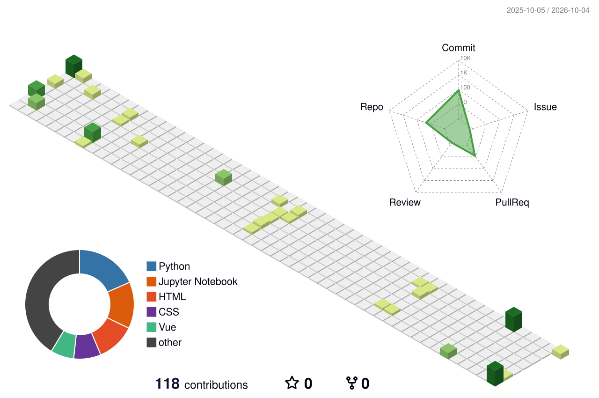

## Hi there 👋

I'm **Pratik Ranjan Bishwal**, an aspiring **Data Scientist & Web Developer** who enjoys building projects, learning new technologies, and solving real-world problems.

🎓 **Education**
- BS in Data Science and Applications — IIT Madras
- Integrated M.Sc. in Computer Science — Central University of Rajasthan

💻 **Tech I'm working with**
- **Languages:** Python, Java, JavaScript
- **Web:** Flask, Vue.js
- **Database:** MySQL, SQLite
- **Other:** Git, GitHub, Data Structures & Algorithms, Machine Learning

🔭 **Currently working on:** Web development, software projects, and Machine Learning projects.

🌱 **Currently learning:** Advanced Machine Learning, Data Science, and software development.

👯 **Open to:** Collaborating on open-source, web development, and Data/ML projects.

💬 **Ask me about:** Python, Flask, databases, web development, Git/GitHub, and Machine Learning.

⚡ **Beyond tech:** I enjoy travelling, exploring new places, and meeting new people.

> **Always learning. Always building. 🚀**
## 🔥 GitHub Streak

## 📈 3D Contribution Graph

  

